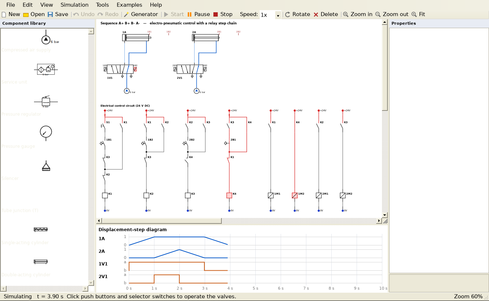
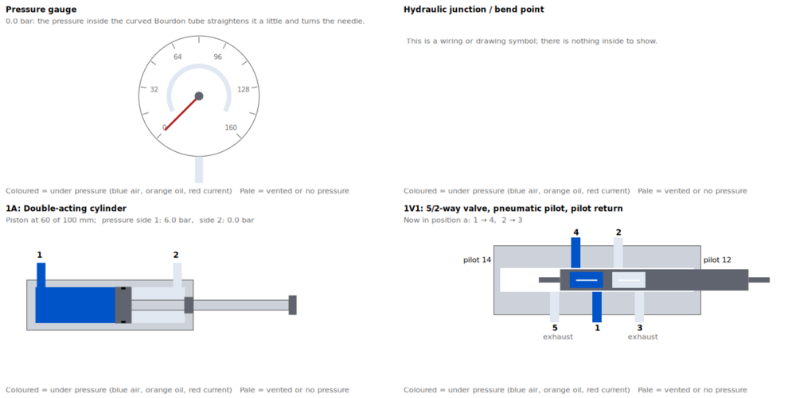
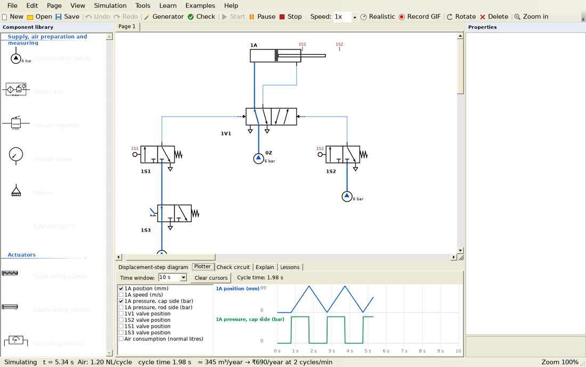
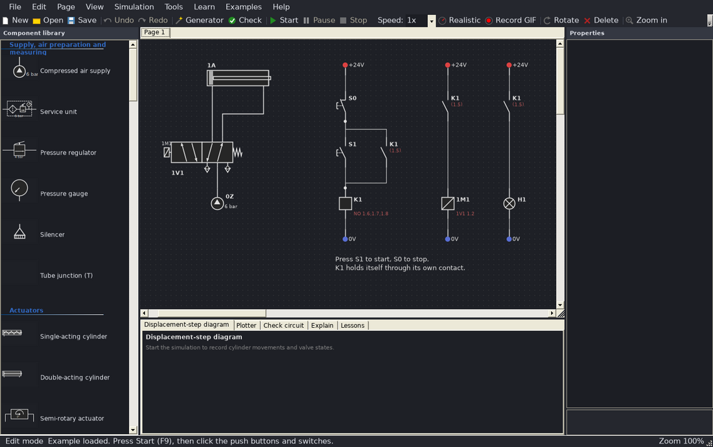
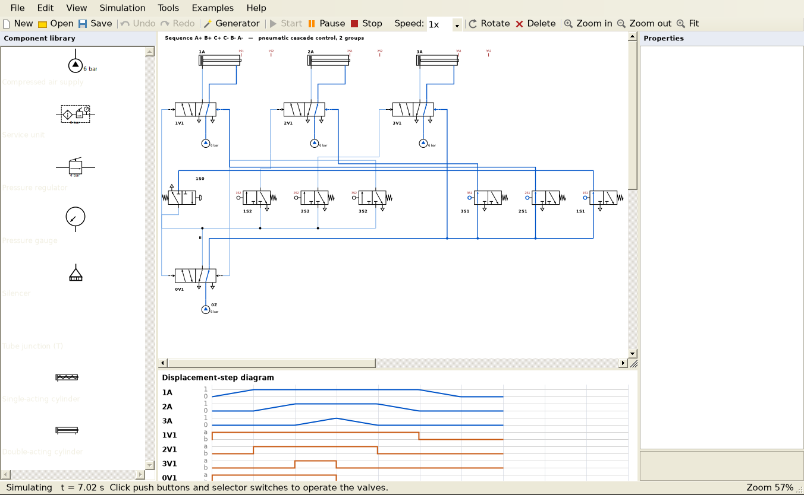

# PneuSim 3.2 – Pneumatic, Electro-pneumatic & Hydraulic Circuit Simulator

A free, FluidSIM-style desktop application for designing, simulating, checking and learning
pneumatic, electro-pneumatic and hydraulic circuits. Written in VB.NET (Windows Forms,
.NET Framework 4.7.2).

(c) 2026 Akshaya Simha. Developed in VB.NET initially, and improved it with vibe coding using
Claude Pro. Software is used to study pneumatic and hydraulic systems, so that it can be
simulated to understand different types of circuits.



## What's new in 3.2

- **Troubleshooting practice.** *New exercise* hides a fault somewhere in the circuit – a
  leaking or blocked tube, a stuck valve, a burnt coil, a broken wire, a sensor that never
  switches, a sticking or jammed cylinder, a clogged silencer or throttle, a weak supply.
  Run the circuit, measure (right-click), ask for hints (area → neighbours → cause) and name
  the faulty part. You get a score and a diagnosis log you can save. Teachers can put any
  fault into any part with *Add fault…*, tick *Hidden*, and hand out the file: it opens as an
  exercise and the answer is not readable in the file.
- **State inspector.** Right-click any component or tube during the simulation to see its live
  values (pressures at every port, position, speed, force, coil voltage, timer, count …).
- **Live sliders.** Change supply pressure, regulator setting, throttle opening, load, mass,
  friction, timer delays, pump flow and more while the circuit runs.
- **Replay.** Step back and forward, jump to the previous or next event (a valve, relay or
  cylinder changing), or drag the time slider; *Start* continues from the moment shown.
- **Parameter sweep** (Tools): run the circuit with one setting changed step by step (e.g.
  3 to 8 bar) and compare cycle time, air per cycle, cylinder timing and top speed in a table
  and a chart; export to CSV.
- **Oscilloscope upgrade.** Trigger (rising / falling, auto or single shot), zoom with the
  mouse wheel, hold and scroll, minimum / maximum / average between the cursors, CSV and PNG
  export.
- **New components:** compressor with pressure switch and air receiver (watch the receiver
  fill and empty), shut-off valve, pressure switch and vacuum switch, vacuum generator
  (ejector) and suction cup, parallel gripper, flow meter, force sensor, preset counter,
  latching emergency stop and the idle-return roller valve – all with symbols, cutaways,
  help texts, prices and checker rules.
- Two new examples (vacuum handling; compressor, receiver and flow meter) and new quiz
  questions on vacuum, air generation and fault finding.

## What's new in 3.1

A full review fixed 30 problems. The most important:

- **Cutaway view of every component** (F7): cylinders, motors, pump, check, shuttle, AND and
  quick exhaust valves, flow controls, regulators, relief and counterbalance valves,
  accumulator, gauge, relays, solenoids and contacts – not only directional valves.
- **Safer:** values are checked as you type them (no more crash with a 0 mm stroke), an error
  never closes the program, and unsaved work is saved every minute and offered back after a
  crash or power cut.
- **Unique names:** new parts are numbered automatically (1A, 2A, 1V1, 1M1, S1, K1 ...); a
  copied circuit gets its own solenoids, relays and position marks. The checker reports
  valves sharing a solenoid, marks used twice and page connectors without a partner.
- **More hydraulics:** check valve, one-way flow control, throttle, pressure reducing valve and
  single-acting cylinder for oil lines.
- **Correct symbols and drawings:** hollow triangles for air (filled only for oil), as in
  ISO 1219; column numbers along the top of every page so cross-references such as "1.5" can
  be found; solenoid labels no longer sit on tubes.
- **Fairer quiz:** answers in random order, never two identical-looking symbols; the exam has a
  Back button and its clock stops when closed. Lesson progress is remembered.
- **Editor:** parts cannot be lost off the sheet, Ctrl + mouse wheel zooms at the pointer,
  Escape closes every dialog, the Properties panel shows only settings that apply (with
  readable names), dark mode reaches the dialogs and tabs, and the toolbar fits the screen.
- **Results:** the air motor's air is counted, lamps no longer act as relays, the right
  solenoid of a double-solenoid valve has its own manual override (click the right half),
  parts lists include hoses and tubing, PDFs show any language, and the two-hand control is no
  longer reported as a problem.



## What's new in 3.0

- **Check my circuit.** A live checker lists problems while you draw: open ports, missing
  exhausts, no air supply, cylinders that can never move, solenoids without a coil, short
  circuits, and **signal overlap** (two opposing signals on one valve). For an overlap, one
  click redesigns the circuit as a pneumatic cascade or an electro-pneumatic relay step chain.
  *Run full check* also test-runs the circuit.
- **Explain my circuit.** A plain-English description: what is in the circuit, how each
  actuator is controlled, the motion sequence, and a step-by-step story of what happens when
  you press a button.
- **Realistic physics mode** (toolbar *Realistic*): pressure builds up in the cylinder
  chambers, flow follows ISO 6358, cylinders move according to bore, rod, load, friction and
  cushioning, pressure sequence valves switch at the real pressure, and the status bar shows
  air consumption per cycle and the running cost in ₹ per year.
- **Hydraulics:** pump, tank, pressure relief valve, 4/3 valves (closed, tandem, float, open
  centre), 4/2 valve, pressure-compensated flow control, counterbalance valve, hydraulic
  cylinder and motor, accumulator and pressure gauge (0–160 bar). Oil lines turn orange.
- **Learn:** 10 lessons whose tasks are checked automatically, an animated cutaway view
  (F7), hover help for every component, a practice quiz and a timed exam.
- **Measure and report:** a plotter (position, speed, chamber pressures, valve positions,
  air consumption) with cycle time, force and valve-size calculators, a parts list with
  costs, and a PDF report with a title block.
- **Drawing and projects:** several pages per project with page connectors and
  cross-references (e.g. relay contacts show where their coil is), SVG and DXF export for
  CAD, animated GIF recording, and dark mode.
- **Installer** with a desktop icon and *.pneu* file association.



## Highlights from earlier versions

- **Automatic circuit generator.** Type a motion sequence such as `A+ B+ B- A-` (or
  `A+ (B+ C+) B- C- A-` with simultaneous moves). PneuSim designs, draws and explains the
  complete circuit, as an electro-pneumatic relay step chain or a pneumatic cascade.
- **Electro-pneumatics:** +24 V / 0 V, push buttons, selector switches, relay contacts,
  proximity sensors, limit switches, relays, timer relays, valve solenoids and lamps.
- **Live simulation** with a displacement-step diagram, and a full editor (undo/redo,
  copy/paste, box selection, rotate, tube bend points and junctions, zoom, PNG export).



## Components

| Group | Components |
|---|---|
| Supply and air preparation | Compressed air supply, compressor, air receiver, shut-off valve, service unit, pressure regulator, pressure gauge, flow meter, force sensor, pressure switch, vacuum switch, silencer, tube junction |
| Actuators and handling | Single-acting cylinder, double-acting cylinder, semi-rotary actuator, air motor, parallel gripper, vacuum generator, suction cup |
| Directional control valves | 2/2, 3/2 (NC/NO), 4/2, 5/2 and 5/3 (closed, exhaust or pressure centre) valves, operated by push button, selector switch, roller lever, idle-return roller, pneumatic pilot, time-delayed pilot or solenoid; spring, pilot or solenoid return |
| Logic, non-return and flow | Shuttle valve (OR), two-pressure valve (AND), check valve, quick exhaust valve, one-way flow control valve, flow control valve |
| Electrical (24 V DC) | +24 V / 0 V connection, push button NO/NC, selector switch, emergency stop, relay contact NO/NC, proximity sensor, limit switch, pressure switch contact, preset counter, relay coil, on-delay and off-delay timer relays, valve solenoid, indicator lamp, wire junction |
| Hydraulics | Pump, tank, pressure relief valve, pressure reducing valve, 4/3 valve (closed, tandem, float, open centre), 4/2 valve, check valve, one-way flow control valve, throttle valve, pressure-compensated flow control valve, counterbalance valve, double- and single-acting hydraulic cylinder, hydraulic motor, accumulator, hydraulic gauge |
| Pressure control | Pressure regulator, pressure sequence valve |
| Drawing | Text notes, page connectors |

## Examples (menu *Examples*)

1. Direct control of a single-acting cylinder
2. Indirect control of a double-acting cylinder with speed control
3. OR: operation from two places (shuttle valve)
4. AND: two-hand safety control (two-pressure valve)
5. Automatic reciprocation with limit valves
6. Delayed return with a time delay valve
7. Electro-pneumatic: direct control with a solenoid valve
8. Electro-pneumatic: self-holding circuit with start / stop and lamp
9. Hydraulics: cylinder with 4/3 valve, relief valve and gauge
10. Realistic mode: pressure sequence valve (clamp, then drill)
11. Vacuum handling: ejector, suction cup and vacuum switch
12. Air generation: compressor, receiver, service unit and flow meter



## Using it

| Task | How |
|---|---|
| Place a component | Click it in the library and click on the drawing, or drag it onto the drawing |
| Connect | Drag from one port (circle) to another. Red circles are electrical terminals |
| Select several | Drag a box on empty space; Ctrl+click adds or removes |
| Edit | Properties panel on the right |
| Undo / redo | Ctrl+Z / Ctrl+Y (or Ctrl+Shift+Z), wherever the focus is |
| Manual override | During simulation click a solenoid valve: left half = left solenoid, right half = right solenoid |
| Copy / cut / paste / duplicate | Ctrl+C / Ctrl+X / Ctrl+V / Ctrl+D |
| Rotate / delete / nudge | R / Del / arrow keys |
| Move a tube | Drag its middle segment |
| Zoom | Ctrl + mouse wheel, Ctrl+9 zooms to fit |
| Simulate | F9 start, F10 pause, F11 stop and reset; click push buttons and switches |
| Generate a circuit | Tools → Circuit Generator (Ctrl+G) |
| Check / explain | Bottom tabs *Check circuit* and *Explain* |
| Realistic physics | Toolbar *Realistic* (bore, load and friction are cylinder properties) |
| Several pages | Page menu; join pages with page connectors of the same name |
| Export | File → Export: PDF report, SVG, DXF, PNG, parts list (CSV) |
| Record | Toolbar *Record GIF*, operate the circuit, click again to save |
| Learn | Learn menu: lessons, quiz, timed exam, cutaway view of the selected or hovered component (F7) |
| Dark mode | View → Dark mode |
| Inspect / tune while running | Right-click a component or tube; sliders on the *Inspector* tab |
| Replay | Toolbar step and event buttons or the time slider; Shift+F12 / F12 step, Ctrl+Shift+F12 / Ctrl+F12 events |
| Troubleshooting | Tools → Troubleshooting, or the *Troubleshoot* tab |
| Parameter sweep | Tools → Parameter sweep |
| Plotter | Click / right-click for cursors A / B, wheel zooms, Shift+wheel scrolls, trigger and export at the top |

Names link things together:
- A valve's *solenoid label* (e.g. `1M1`) matches a *Valve solenoid* coil.
- A relay contact's *Reference* (e.g. `K1`) matches a relay coil.
- A roller valve, proximity sensor or limit switch reacts to a cylinder's *position mark*
  (e.g. `1S2` or `1B2`).

## Building

Open `PneuSim.vbproj` in **Visual Studio 2022** and press **F5**, or build from the command line:

```
dotnet build PneuSim/PneuSim.vbproj -c Release
```

The output is `PneuSim\bin\Release\net472\PneuSim.exe`. A ready-to-run build is included as
`PneuSim_App.zip` at the top of the repository.

The GitHub workflow *PneuSim* (Actions tab) builds the program, runs the tests and publishes
two downloads: **PneuSim-Windows** (the program folder) and **PneuSim-Setup** (the installer,
made with Inno Setup from `installer/PneuSim.iss`).

### Code signing

Windows SmartScreen warns about any program that is not signed with a code-signing
certificate. The workflow signs the EXE and the installer automatically when two repository
secrets exist: `SIGNING_CERT_BASE64` (the .pfx file as base64) and `SIGNING_CERT_PASSWORD`.
A certificate has to be bought from a certificate authority; without one the program works
the same, and you click *More info → Run anyway* the first time.

## How the simulation works

In **realistic mode** each cylinder chamber holds a mass of air; flow through each path
follows ISO 6358 (sonic conductance and critical pressure ratio), the piston force comes from
the chamber pressures, load, friction and spring, and the motion is integrated in 0.2 ms
steps. In **hydraulics**, cylinder speed is pump flow divided by piston area, the pressure is
set by the load, and the relief valve limits it. The ideal (default) mode works as follows:

- Every port is a node. Tubes, wires, open valve passages and closed contacts are edges.
  An edge can allow flow in one direction only (check valve, quick exhaust valve) and can limit
  the pressure it passes on (regulator).
- Ports reachable from a supply (or +24 V) are **pressurized** (or live). Ports that can vent to
  an open exhaust (or reach 0 V) are **exhausted**. All other ports keep their trapped pressure.
- Valves, relays and contacts then switch: pilot pressure ≥ 1.5 bar, energized coils, buttons,
  rollers and timers. The network is solved again until nothing changes.
- Flow control valves reduce the capacity of their passage, which can depend on direction.
  A cylinder's speed is set by the narrowest point on its supply path and on its exhaust path,
  so meter-in and meter-out control behave as in a real circuit.
- Double-acting cylinders compare the forces on both sides (the rod side has 70 % of the
  piston area). A cylinder whose outlet air is trapped cannot move.

## Project layout

```
PneuSim/
  Core/        Circuit model, ports, tubes, projects, simulator (ideal, realistic, hydraulic,
               air generation, vacuum, flow measurement), faults, replay recorder,
               drawing surfaces, SVG / DXF / PDF export
  Elements/    Supply, cylinders, directional valves, logic/flow valves, extras, electrical,
               automation parts (switches, vacuum, gripper, compressor, receiver, meters)
  Generator/   Sequence parser, circuit generator (relay step chain, cascade), dialog
  Learning/    Lessons, question bank, component help
  Tools/       Circuit checker and explainer, troubleshooting exercises, parameter sweep,
               parts list, PDF report, GIF recorder
  UI/          Main window, canvas, diagram, plotter, dialogs, library, examples
  installer/   Inno Setup script
```

To add a component: derive from `CircuitElement`, add ports in the constructor, draw it in
`DrawSymbol`, and add its passages in `AddEdges`. Optionally list its faults in
`PossibleFaults`, its live values in `InspectValues` and its cutaway in `UI/Cutaways.vb`. Then register it in
`Elements/ElementFactory.vb` and in `UI/Library.vb`.
