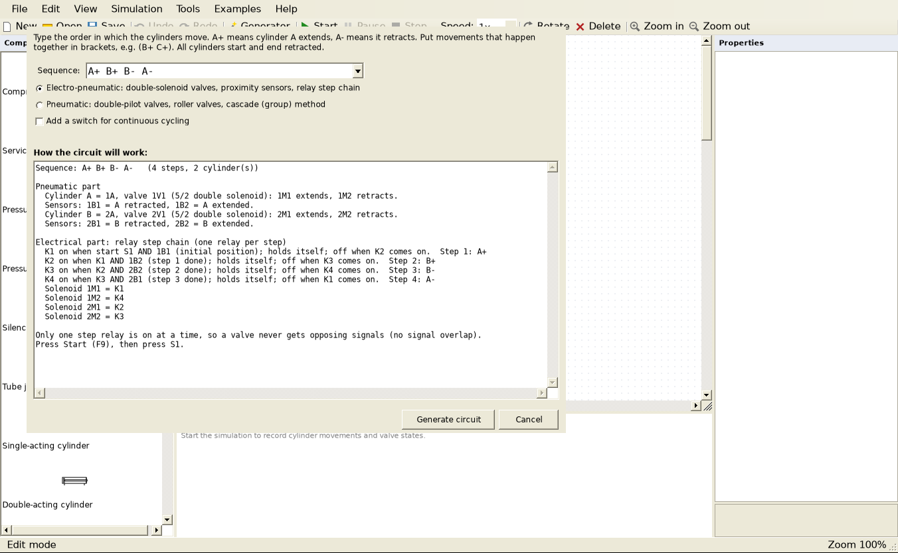

# PneuSim – Pneumatic & Electro-pneumatic Circuit Simulator

A free, FluidSIM-style desktop application for designing and simulating pneumatic and
electro-pneumatic circuits. Written in VB.NET (Windows Forms, .NET Framework 4.7.2).


## Highlights

- **Automatic circuit generator.** Type a motion sequence such as `A+ B+ B- A-` (or
  `A+ (B+ C+) B- C- A-` with simultaneous moves). PneuSim designs, draws and explains the
  complete circuit, using either:
  - **Electro-pneumatic:** double-solenoid valves, proximity sensors and a relay step chain
    (one latching relay per step, so there is never signal overlap), or
  - **Pneumatic cascade:** double-pilot valves, roller valves, group lines and cascade valves,
    with automatic grouping (including merging the last and first group).
- **Electro-pneumatics:** +24 V / 0 V connections, push buttons, selector switches, relay
  contacts (NO/NC), proximity sensors, limit switches, relays, on-delay and off-delay timer
  relays, valve solenoids and indicator lamps. Live wires turn red.
- **Live simulation:** pressurized lines turn blue, valve symbols slide between positions,
  cylinders move at realistic speeds, and a displacement-step diagram is recorded.
- **Full editor:** undo/redo, copy/paste/duplicate, box selection, rotate, adjustable tube
  segments, bend points and T-junctions, a property grid, zoom to fit, and PNG export.



## Components

| Group | Components |
|---|---|
| Supply and air preparation | Compressed air supply, service unit, pressure regulator, pressure gauge, silencer, tube junction |
| Actuators | Single-acting cylinder, double-acting cylinder, semi-rotary actuator, air motor |
| Directional control valves | 2/2, 3/2 (NC/NO), 4/2, 5/2 and 5/3 (closed, exhaust or pressure centre) valves, operated by push button, selector switch, roller lever, pneumatic pilot, time-delayed pilot or solenoid; spring, pilot or solenoid return |
| Logic, non-return and flow | Shuttle valve (OR), two-pressure valve (AND), check valve, quick exhaust valve, one-way flow control valve, flow control valve |
| Electrical (24 V DC) | +24 V / 0 V connection, push button NO/NC, selector switch, relay contact NO/NC, proximity sensor, limit switch, relay coil, on-delay and off-delay timer relays, valve solenoid, indicator lamp, wire junction |
| Drawing | Text notes |

## Examples (menu *Examples*)

1. Direct control of a single-acting cylinder
2. Indirect control of a double-acting cylinder with speed control
3. OR: operation from two places (shuttle valve)
4. AND: two-hand safety control (two-pressure valve)
5. Automatic reciprocation with limit valves
6. Delayed return with a time delay valve
7. Electro-pneumatic: direct control with a solenoid valve
8. Electro-pneumatic: self-holding circuit with start / stop and lamp


## Using it

| Task | How |
|---|---|
| Place a component | Click it in the library and click on the drawing, or drag it onto the drawing |
| Connect | Drag from one port (circle) to another. Red circles are electrical terminals |
| Select several | Drag a box on empty space; Ctrl+click adds or removes |
| Edit | Properties panel on the right |
| Undo / redo | Ctrl+Z / Ctrl+Y |
| Copy / cut / paste / duplicate | Ctrl+C / Ctrl+X / Ctrl+V / Ctrl+D |
| Rotate / delete / nudge | R / Del / arrow keys |
| Move a tube | Drag its middle segment |
| Zoom | Ctrl + mouse wheel, Ctrl+9 zooms to fit |
| Simulate | F9 start, F10 pause, F11 stop and reset; click push buttons and switches |
| Generate a circuit | Tools → Circuit Generator (Ctrl+G) |

Names link things together:
- A valve's *solenoid label* (e.g. `1M1`) matches a *Valve solenoid* coil.
- A relay contact's *Reference* (e.g. `K1`) matches a relay coil.
- A roller valve, proximity sensor or limit switch reacts to a cylinder's *position mark*
  (e.g. `1S2` or `1B2`).

## Building

Open `PneuSim.vbproj` in **Visual Studio 2022** and press **F5**, or build from the command line:

```
dotnet build PneuSim/PneuSim.vbproj -c Release
```

The output is `PneuSim\bin\Release\net472\PneuSim.exe`. A ready-to-run build is included as
`PneuSim_App.zip` at the top of the repository.

## How the simulation works

- Every port is a node. Tubes, wires, open valve passages and closed contacts are edges.
  An edge can allow flow in one direction only (check valve, quick exhaust valve) and can limit
  the pressure it passes on (regulator).
- Ports reachable from a supply (or +24 V) are **pressurized** (or live). Ports that can vent to
  an open exhaust (or reach 0 V) are **exhausted**. All other ports keep their trapped pressure.
- Valves, relays and contacts then switch: pilot pressure ≥ 1.5 bar, energized coils, buttons,
  rollers and timers. The network is solved again until nothing changes.
- Flow control valves reduce the capacity of their passage, which can depend on direction.
  A cylinder's speed is set by the narrowest point on its supply path and on its exhaust path,
  so meter-in and meter-out control behave as in a real circuit.
- Double-acting cylinders compare the forces on both sides (the rod side has 70 % of the
  piston area). A cylinder whose outlet air is trapped cannot move.

## Project layout

```
PneuSim/
  Core/        Circuit model, ports, tubes, file format, simulator, drawing helpers
  Elements/    Supply, cylinders, directional valves, logic/flow valves, extras, electrical
  Generator/   Sequence parser, circuit generator (relay step chain, cascade), dialog
  UI/          Main window, canvas, diagram, component library, examples
```

To add a component: derive from `CircuitElement`, add ports in the constructor, draw it in
`DrawSymbol`, and add its passages in `AddEdges`. Then register it in
`Elements/ElementFactory.vb` and in `UI/Library.vb`.
