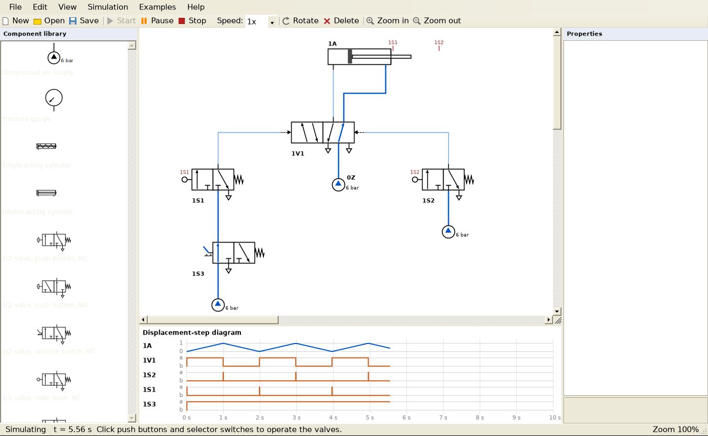
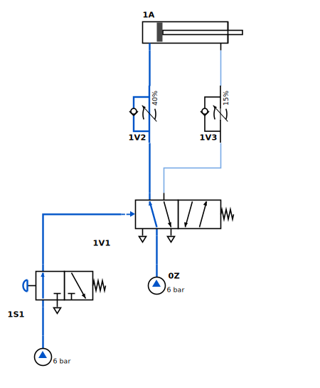

# PneuSim – Pneumatic Circuit Simulator

A FluidSIM-style desktop application for drawing and simulating pneumatic circuits,
written in VB.NET (Windows Forms, .NET Framework 4.7.2).



## Features

**Circuit editor**
- Component library with ISO 1219 symbols. Click a component and then click the drawing,
  or drag it onto the drawing.
- Drag from one port (small circle) to another to lay a tube. Tubes are routed
  automatically with right angles and follow components when you move them.
- Move with the mouse, rotate with **R**, delete with **Del**, zoom with **Ctrl + wheel**.
- Property grid for every component: label, actuation type, return type, stroke time,
  supply pressure, throttle opening, position marks, timer delay…
- Save and open circuits (`*.pneu`, XML), and export the drawing as a PNG image.

**Simulation**
- Pressurized lines and valve passages turn dark blue.
- Valves visibly switch: the boxes slide so the active position sits over the ports.
- Operate push buttons (hold the mouse button) and selector switches with the mouse.
- Roller lever valves are operated by cylinder position marks, e.g. `1S1` (retracted) and `1S2` (extended).
- One-way flow control valves set cylinder speed (meter-in or meter-out).
- Time delay valves, shuttle valves (OR) and two-pressure valves (AND).
- Trapped air: a cylinder whose outlet side is blocked does not move.
- Warnings for air escaping from open ports and for oscillating circuits.
- Live **displacement-step diagram** of the cylinders and labelled valves.
- Simulation speed from 0.25x to 4x, plus pause.

**Components**

| Group | Components |
|---|---|
| Supply and measuring | Compressed air supply, pressure gauge |
| Actuators | Single-acting cylinder (spring return), double-acting cylinder |
| Directional control valves | 3/2 (NC / NO) and 5/2 valves operated by push button, selector switch, roller lever, pneumatic pilot or time-delayed pilot; spring or pilot return (memory valve) |
| Logic and flow control | Shuttle valve (OR), two-pressure valve (AND), one-way flow control valve, flow control valve |

**Built-in examples** (menu *Examples*)
1. Direct control of a single-acting cylinder
2. Indirect control of a double-acting cylinder with speed control
3. OR: operation from two places (shuttle valve)
4. AND: two-hand safety control (two-pressure valve)
5. Automatic reciprocation with limit valves
6. Delayed return with a time delay valve



## Building and running

Open `PneuSim.vbproj` in **Visual Studio 2022** and press **F5**.

From the command line (needs the .NET SDK 6 or later):

```
dotnet build PneuSim/PneuSim.vbproj -c Release
PneuSim\bin\Release\net472\PneuSim.exe
```

The project references `Microsoft.NETFramework.ReferenceAssemblies`, so it builds even
without the .NET Framework 4.7.2 developer pack installed.

## How the simulation works

- Every port is a node. Tubes and the open passages inside valves (for their current
  position) join nodes into groups.
- A group linked to a supply is **pressurized**. A group linked to an open exhaust
  (unconnected valve exhaust port 3/5, or an unconnected cylinder port) is **vented**.
  Any other group keeps the pressure trapped inside it.
- Valves then switch from their actuators (pilot pressure ≥ 1.5 bar, buttons, rollers,
  timers). Pressures are solved again until nothing changes.
- Flow control valves give their passage a reduced capacity. Capacity can depend on
  direction when there is a check valve: free flow is 1 → 2, throttled flow is 2 → 1.
  A cylinder's speed is set by the narrowest point on its supply path and on its
  exhaust path. That is why meter-out control works as in a real circuit.
- Double-acting cylinders compare the force on both sides (the rod side has 70 % of the
  piston area). If both sides are pressurized, the cylinder still extends, slowly.

## Project layout

```
PneuSim/
  Core/        Circuit model, ports, tubes, file format, simulator, drawing helpers
  Elements/    Supply, gauge, cylinders, directional valves, logic and flow valves
  UI/          Main window, drawing canvas, diagram, component library, examples
  Program.vb   Entry point
```

Adding a component: derive from `CircuitElement`, add ports in the constructor, draw the
symbol in `DrawSymbol`, and add passages in `AddEdges`. Then register it in
`ElementFactory` (Elements/FlowAndLogicValves.vb) and in `Library.Presets`.
